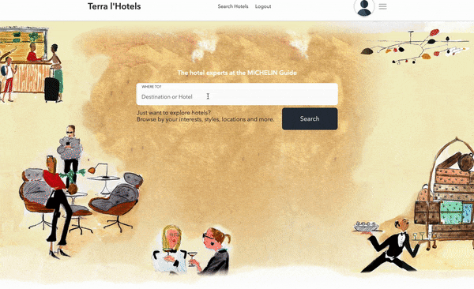

# Terra l'Hotel
Check out the live app [here.](https://terralhotel.herokuapp.com/) \
For design documentation, see wiki [here.](https://github.com/vera-ho/TerraLHotel/wiki) 

Quick Links: \
[Introduction](#introduction) \
[Functionality and Features](#functionality-and-features) \
[Running the Project](#running-the-project)



## Introduction
[Terra l'Hotel](https://terralhotel.herokuapp.com/) is a pixel perfect full stack clone of the [Tablet Hotels](http://www.tablethotels.com) website from 2022. It is created for educational purposes only. Please do not enter any sensitive data while exploring Terra l'Hotel.

```
Note as of Nov 2024: Ruby and Ruby on Rails versions used in this project are deprecated and no longer compatible with the Heroku platform. Some images/reservations/reviews are no longer functional until the versions on Heroku are updated or I've completed migration to a different backend. In the meantime, the demo animation above demonstrates the functionality and notes have been added to run the project for those who would like to interact with the full project. 
```

### Technologies Used
* Frontend: `React and Redux`
    - `react-redux`
    - `redux-thunk`
    - `react hooks`
* Backend: `Ruby on Rails`
    - `bcrypt` - user authentication
* Database: `PostgreSQL`
* Languages
    - `Javascript`
    - `Ruby`
    - `HTML and CSS`
* Bundlers and Compilers
    - `webpack` - module bundler
    - `babel` - JavaScript ES6 compliler
* Additional APIs:
    - `Google Maps API`
* Hosting: `Heroku`

## Functionality and Features
There are completed features for Terra l'Hotel:
* `User` authentication
* `Hotel` listing and details
* `Reservation` creation, lists, editing and cancellation
* `Review` creation, lists, editing and deletion

Key features for the completed project, including 2 full `CRUD` cycles: 
### Users 
Users are able to register for an account, login, and logout as needed on the website. The user authentication on the backend uses Ruby on Rails with BCrypt to secure password information. 
    - User authentication - register, signin, logout
    - Ability to:
        - `View` hotels and hotel details
        - `Create`, `Read`, `Update` and `Destroy` reservations
        - `Create`, `Read`, `Update` and `Destroy` reviews
        - `Favorite` hotels

### Hotels
Users are able to search, view listings and details.
- `Searchable` by hotel name, city, state, or country
- Listings can be further filtered
- `Show` hotel details
    - Basic information: name, location, description
    - Accomadation informtion: amentities, total number of rooms at the property, room occupancy and size
    - Media: hotel and room images, location on Google Maps

### Reservations
Users are able to create, read, update and destroy reservation entries.
- Reservation dates are `selectable` in the hotel details page to book a hotel room
- Reservations can be edited and cancelled from the reservation listing page
- To create a reservation, a user must be logged in
- User is redirected to reservation listings after booking
- Hotel information for booking is dervived from the hotel details page, not the user input

### Reviews
Users are able to create, read, update and destroy review entries. Users can view all reviews for any hotel, and only edit and delete their own reviews.
- Reviews for a hotel are shown on the hotel's details page
- Reviews for a hotel can be written from the user's reservation page
- Reviews are shown and can be edited or deleted from the user's reviews listing page
- To create a reservation, a user must be logged in and the dates of the stay must be before the current date

### Search
On the home page, there is a search form where users are able to search for hotels by name or location (city, state, and country). If the search returns zero entries, the web application will return all listings available in the database. 

## Running the Project
If the project is cloned and you want to run it locally, a PostgreSQL server must be set up and seeded using:
```
bundle exec rails db:create db:migrate
bundle exec rails db:seed
```

Two terminals are needed to run the Rails server and to start npm:
```
rails s
```
and 
```
npm run watch
```

The project can then be viewed at `localhost:3000`.